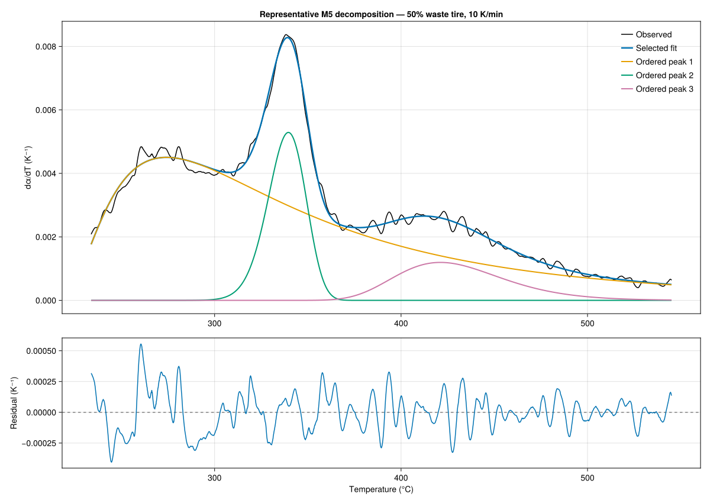
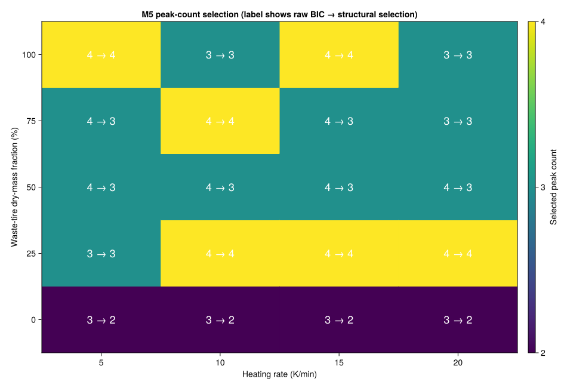

# M5 Fraser–Suzuki deconvolution audit

Generated by `scripts/audit_deconvolution.jl` on 2026-08-17.

## Scope and frozen contract

The audit decomposes `dalpha/dT` for all 20 dynamic calibration experiments over exact first-upward conversion crossings from 0.05 to 0.95. The 15 ramp-and-hold experiments remain held out. No peak is assigned a chemical identity.

Each candidate uses ordered centers separated by at least 8.0 K, nonnegative heights, skew bounds (-1.5, 1.5), width bounds (5.0, 250.0) K, and deterministic 5-start L-BFGS optimization. The fit never clips negative measured derivative values.

The predeclared synthetic gates require center recovery within 4 K, component area-fraction recovery within 0.04, RMSE below `5e-5 K^-1`, correct BIC selection under deterministic unstructured noise, and joint-fit order invariance.

## Peak-count comparison

Raw BIC minima: 3 × 8, 4 × 12.

Final selections after structural filtering: 2 × 4, 3 × 10, 4 × 6.

A raw criterion minimum is not automatically accepted. Candidates are excluded from selection when they do not converge, are locally rank/condition deficient, activate a physical bound or minimum center separation, or assign less than 2.0% of the reconstructed area to a component.

If no candidate passes every structural check, the raw criterion minimum is retained with a `warning` status rather than silently dropping the experiment.

| Experiment | Tire dry mass | Rate (K/min) | Raw BIC minimum | Selected | Selection status | RMSE (K⁻¹) | R² | Area error | Max abs. correlation |
|---|---:|---:|---:|---:|---|---:|---:|---:|---:|
| `dynamic_wt000_rate05` | 0% | 5 | 3 | 2 | `constraint_filtered` | 0.000502 | 0.9710 | 4.35% | 0.9992 |
| `dynamic_wt000_rate10` | 0% | 10 | 3 | 2 | `constraint_filtered` | 0.000514 | 0.9677 | 5.09% | 0.9992 |
| `dynamic_wt000_rate15` | 0% | 15 | 3 | 2 | `constraint_filtered` | 0.000520 | 0.9667 | 5.08% | 0.9994 |
| `dynamic_wt000_rate20` | 0% | 20 | 3 | 2 | `constraint_filtered` | 0.000532 | 0.9644 | 5.48% | 0.9996 |
| `dynamic_wt025_rate05` | 25% | 5 | 3 | 3 | `selected` | 0.000137 | 0.9970 | 0.01% | 0.9991 |
| `dynamic_wt025_rate10` | 25% | 10 | 4 | 4 | `warning` | 0.000160 | 0.9949 | 0.01% | 1.0000 |
| `dynamic_wt025_rate15` | 25% | 15 | 4 | 4 | `selected` | 0.000121 | 0.9974 | 0.00% | 0.9998 |
| `dynamic_wt025_rate20` | 25% | 20 | 4 | 4 | `selected` | 0.000094 | 0.9984 | 0.10% | 0.9990 |
| `dynamic_wt050_rate05` | 50% | 5 | 4 | 3 | `constraint_filtered` | 0.000138 | 0.9945 | 0.03% | 0.9995 |
| `dynamic_wt050_rate10` | 50% | 10 | 4 | 3 | `constraint_filtered` | 0.000151 | 0.9934 | 0.01% | 0.9996 |
| `dynamic_wt050_rate15` | 50% | 15 | 4 | 3 | `constraint_filtered` | 0.000125 | 0.9955 | 0.06% | 0.9994 |
| `dynamic_wt050_rate20` | 50% | 20 | 4 | 3 | `constraint_filtered` | 0.000133 | 0.9952 | 0.08% | 0.9956 |
| `dynamic_wt075_rate05` | 75% | 5 | 4 | 3 | `constraint_filtered` | 0.000156 | 0.9867 | 0.01% | 0.9995 |
| `dynamic_wt075_rate10` | 75% | 10 | 4 | 4 | `selected` | 0.000141 | 0.9886 | 0.00% | 0.9991 |
| `dynamic_wt075_rate15` | 75% | 15 | 4 | 3 | `constraint_filtered` | 0.000177 | 0.9815 | 0.02% | 0.9996 |
| `dynamic_wt075_rate20` | 75% | 20 | 3 | 3 | `selected` | 0.000194 | 0.9728 | 0.01% | 0.9998 |
| `dynamic_wt100_rate05` | 100% | 5 | 4 | 4 | `ambiguous` | 0.000118 | 0.9872 | 0.00% | 0.9950 |
| `dynamic_wt100_rate10` | 100% | 10 | 3 | 3 | `selected` | 0.000112 | 0.9891 | 0.01% | 0.9994 |
| `dynamic_wt100_rate15` | 100% | 15 | 4 | 4 | `ambiguous` | 0.000100 | 0.9911 | 0.00% | 0.9983 |
| `dynamic_wt100_rate20` | 100% | 20 | 3 | 3 | `selected` | 0.000193 | 0.9685 | 0.01% | 0.9998 |

## Joint multi-rate evaluation

The joint experiment shares skew by ordered component while retaining rate-specific heights, centers, and widths. Its objective is compared with the corresponding independent three-peak fits on the same downsampled points.

| Tire dry mass | Shared skews | Relative objective increase | Status |
|---:|---|---:|---|
| 0% | 0.384, -0.193, 1.153 | 3.45% | `ok` |
| 25% | 0.890, -0.168, 1.001 | 10.72% | `not_converged` |
| 50% | 0.941, -0.160, 0.263 | 6.77% | `warning` |
| 75% | 0.854, -0.131, 0.071 | 0.54% | `ok` |
| 100% | 0.822, -0.060, 0.295 | 1.73% | `not_converged` |

At least one shared-skew joint fit fails the 5% objective-increase gate or does not converge. Joint fitting remains an evaluated diagnostic rather than the default decomposition for later milestones.

## Identifiability and interpretation

Reported parameter intervals are local linearized Student-t intervals derived from the physical-parameter Jacobian. Rank, column-normalized condition, and parameter correlation are reported separately. Narrow residual error does not establish that a peak is a distinct chemical reaction, and highly correlated or boundary-active parameters must not be propagated as identified components. The derivative residuals are serially correlated, so BIC/AICc and local intervals are conditional comparison diagnostics rather than independent-error inference.

M5 satisfies its synthetic recovery and visibility gates. The machine report retains every candidate, component curve summary, bound diagnostic, uncertainty summary, and joint-fit result for downstream review.
