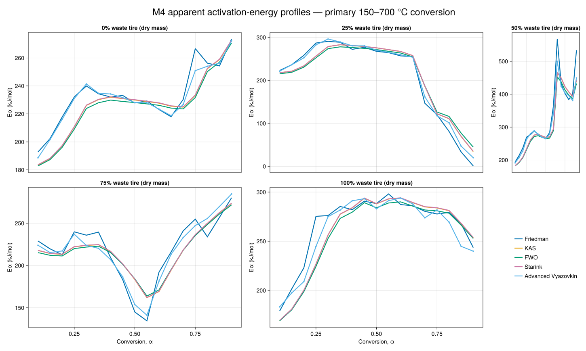
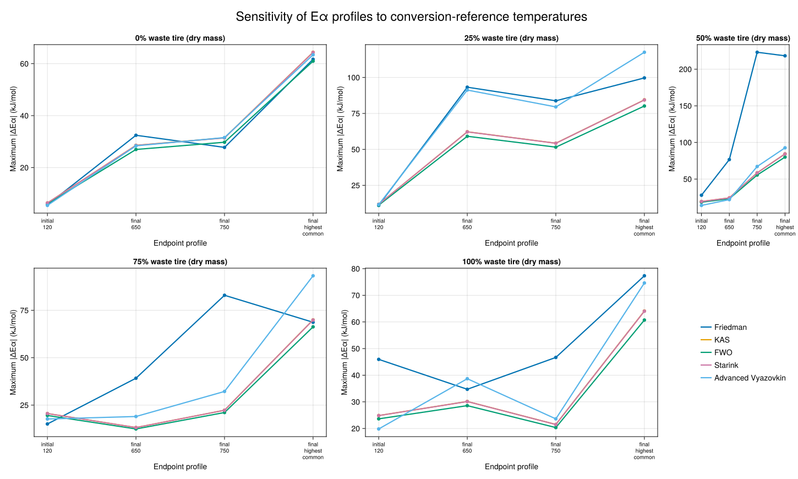

# M4 isoconversional-method audit

Generated by `scripts/audit_isoconversional.jl` on 2026-08-17.

## Scope and acceptance contract

The audit uses only the 20 dynamic calibration runs: five dry-mass compositions and four heating programs per composition. All 15 ramp-and-hold runs remain held out for predictive validation. Every method uses the same 17-point conversion grid from 0.1 to 0.9.

The predeclared synthetic gates are: Friedman error below 0.5 kJ/mol, advanced-Vyazovkin error below 0.75 kJ/mol, integral-linear method error below 8 kJ/mol, and noisy-fixture error below 15 kJ/mol. These are enforced in `test/test_isoconversional.jl` and were not tuned against the real data.

## Frozen numerical conventions

- Conversion interpolation: first acquisition-order upward crossing; no extrapolation or monotonic repair.
- Linear methods: ordinary least squares with two-sided 95% Student-t intervals for the transformed slope.
- Linear-fit diagnostics: results remain available but are flagged when R² is below 0.9.
- Advanced Vyazovkin: true pairwise objective, log-scaled trapezoidal integrals, bounded scan plus golden-section refinement, and explicit boundary/flat/multimodal flags.
- Advanced uncertainty: the Vyazovkin–Wight pairwise-variance Fisher interval; optimizer quality remains a separate diagnostic.
- FWO: retained as a named compatibility result, not selected as the preferred integral approximation.

## Primary 150–700 °C results

| Tire dry-mass fraction | Method | Valid points | Median E (kJ/mol) | Range (kJ/mol) | Minimum R² | Statuses |
|---:|---|---:|---:|---:|---:|---|
| 0% | Friedman | 17/17 | 232.10 | 192.76–273.51 | 0.8766 | `ok` × 16, `warning` × 1 |
| 0% | KAS | 17/17 | 228.86 | 183.50–272.54 | 0.9393 | `ok` × 17 |
| 0% | FWO | 17/17 | 227.16 | 182.82–270.75 | 0.9441 | `ok` × 17 |
| 0% | Starink | 17/17 | 229.08 | 183.70–272.81 | 0.9395 | `ok` × 17 |
| 0% | Advanced Vyazovkin | 17/17 | 230.95 | 188.61–272.20 | — | `ok` × 17 |
| 25% | Friedman | 17/17 | 256.94 | 0.92–290.71 | 0.0001 | `ok` × 11, `warning` × 6 |
| 25% | KAS | 17/17 | 256.23 | 34.30–282.82 | 0.0857 | `ok` × 12, `warning` × 5 |
| 25% | FWO | 17/17 | 252.37 | 44.63–277.99 | 0.1497 | `ok` × 12, `warning` × 5 |
| 25% | Starink | 17/17 | 256.40 | 34.78–282.98 | 0.0880 | `ok` × 12, `warning` × 5 |
| 25% | Advanced Vyazovkin | 17/17 | 253.76 | 20.00–296.16 | — | `boundary_solution` × 1, `ok` × 11, `warning` × 5 |
| 50% | Friedman | 17/17 | 283.63 | 193.92–567.67 | 0.8540 | `ok` × 15, `warning` × 2 |
| 50% | KAS | 17/17 | 275.71 | 182.74–465.68 | 0.8490 | `ok` × 16, `warning` × 1 |
| 50% | FWO | 17/17 | 271.29 | 182.00–452.70 | 0.8551 | `ok` × 16, `warning` × 1 |
| 50% | Starink | 17/17 | 275.88 | 182.95–465.73 | 0.8493 | `ok` × 16, `warning` × 1 |
| 50% | Advanced Vyazovkin | 17/17 | 279.83 | 191.20–500.00 | — | `boundary_solution` × 1, `ok` × 11, `warning` × 5 |
| 75% | Friedman | 17/17 | 228.96 | 134.53–280.08 | 0.9164 | `ok` × 17 |
| 75% | KAS | 17/17 | 217.76 | 161.90–273.35 | 0.9562 | `ok` × 17 |
| 75% | FWO | 17/17 | 215.34 | 163.89–271.69 | 0.9614 | `ok` × 17 |
| 75% | Starink | 17/17 | 217.93 | 162.19–273.63 | 0.9565 | `ok` × 17 |
| 75% | Advanced Vyazovkin | 17/17 | 220.28 | 141.22–284.56 | — | `ok` × 17 |
| 100% | Friedman | 17/17 | 279.28 | 179.08–298.08 | 0.9707 | `ok` × 17 |
| 100% | KAS | 17/17 | 281.09 | 169.31–293.94 | 0.9765 | `ok` × 17 |
| 100% | FWO | 17/17 | 278.51 | 169.05–290.02 | 0.9786 | `ok` × 17 |
| 100% | Starink | 17/17 | 281.34 | 169.52–294.15 | 0.9766 | `ok` × 17 |
| 100% | Advanced Vyazovkin | 17/17 | 274.97 | 183.21–293.88 | — | `ok` × 17 |

All primary method/composition combinations return all requested conversion points. The advanced method exposes a lower-bound solution in one point of the 25% tire mixture and an upper-bound solution in one point of the 50% mixture. These are numerical/scientific warnings, not missing-data events; the affected values must not be interpreted as unconstrained estimates.
The remaining advanced-method warnings in those two mixtures are Fisher intervals truncated at one or both configured energy bounds. They diagnose weakly bounded uncertainty; they are not additional optimizer failures.
The very low minimum R² and low activation-energy tail for the 25% mixture show that its highest-conversion region does not support a reliable straight-line summary across the four heating programs. The values are retained and flagged; they are not evidence for a near-zero physical barrier.

## Conversion-endpoint sensitivity

The primary coordinate is compared with the M0/M3 alternatives below. Differences are absolute changes relative to the primary activation-energy profile at the same reported conversion.

| Endpoint profile | Initial (°C) | Final (°C) | Median across method/composition maxima (kJ/mol) | Largest maximum (kJ/mol) |
|---|---:|---:|---:|---:|
| `initial_120` | 120.0 | 700.000 | 17.68 | 45.95 |
| `final_650` | 150.0 | 650.000 | 28.57 | 93.25 |
| `final_750` | 150.0 | 750.000 | 32.21 | 223.16 |
| `final_highest_common` | 150.0 | 794.430 | 74.62 | 218.31 |

Endpoint sensitivity is reported separately from statistical intervals because it changes the definition of conversion itself. The complete method- and composition-level values are stored in `audits/m4_isoconversional_results.toml`.

## Interpretation and M4 decision

KAS, FWO, Starink, Friedman, and advanced Vyazovkin show broadly consistent central profiles, while departures near individual conversion regions are retained as useful evidence of changing apparent kinetics. FWO remains available for thesis/legacy comparison, but Starink and advanced Vyazovkin are the preferred integral summaries because FWO uses the coarser Doyle approximation.

M4 satisfies its exit gate: the shared interpolation contract and every method pass known-energy and noisy synthetic tests; arbitrary experiment counts and permutation invariance are tested; real-data results are complete and retain all diagnostic warnings. M5 can consume the typed results without treating this audit as model validation of the held-out ramp-and-hold programs.
