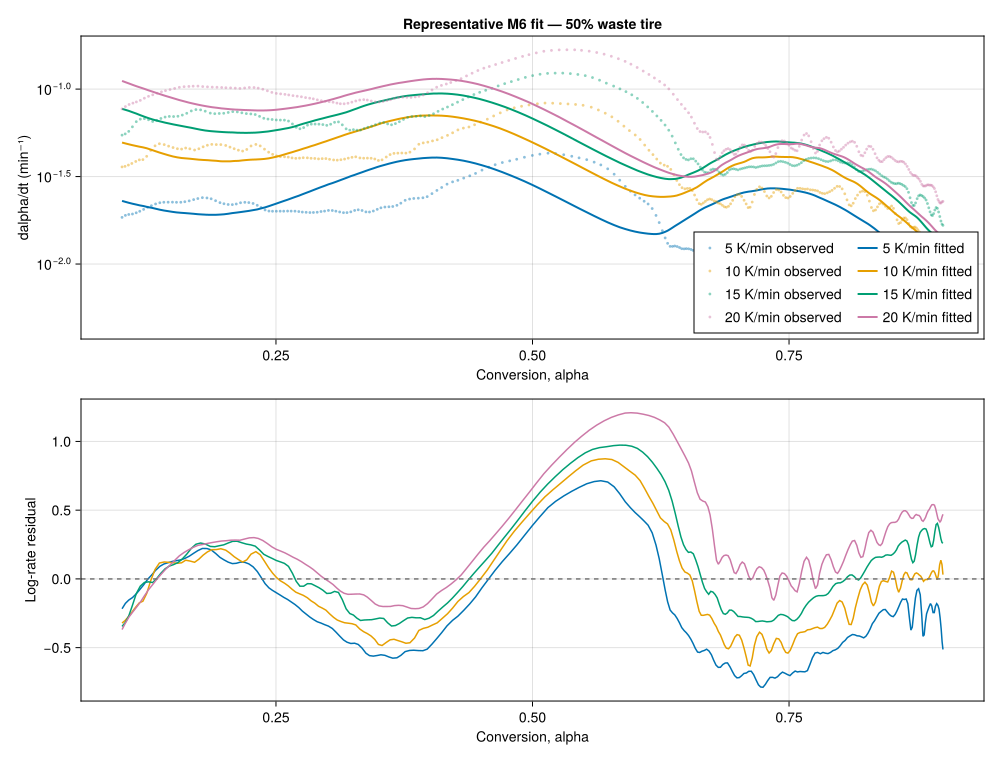
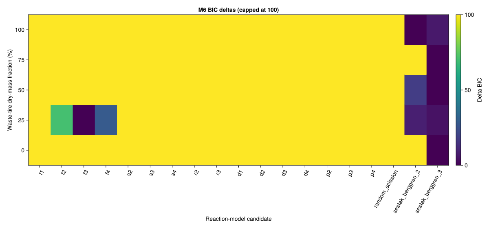
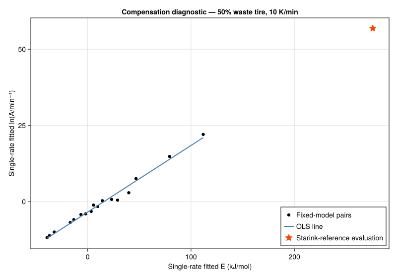

# M6 kinetic-triplet and reaction-model audit

Generated by `scripts/audit_reaction_models.jl` on 2026-08-17.

## Scope and frozen contract

The audit fits one overall-conversion kinetic triplet jointly to the four dynamic heating programs for each dry-mass composition. It uses `dalpha/dt` between exact first-upward conversion crossings from 0.1 to 0.9. The 15 ramp-and-hold programs remain held out for M7, and no M5 peak is assigned a common reaction identity.

Every regression contains one `ln(A / min^-1)` intercept and one activation energy in kJ/mol. Fixed models add no fitted shape coefficient; truncated and generalized Sestak-Berggren candidates add `(m,n)` and `(m,n,p)`. Each run contributes at most 250 deterministic points, and nonpositive rates are counted and excluded because their logarithm is undefined.

Synthetic gates require exact `(E, ln A, m, n)` recovery within `1e-5`, correct noisy-model selection, finite covariance propagation, visible invalid rates, and permutation-invariant results. Real-data predictive adequacy requires leave-one-heating-rate-out log-rate RMSE no greater than 0.25.

## Multi-rate model comparison

Final selected models: `f3` × 1, `sestak_berggren_2` × 4.

| Waste-tire dry-mass fraction | Raw BIC minimum | Selected | Status | E (kJ/mol) | ln(A/min⁻¹) | m | n | p | Fit log-RMSE | Held-out log-RMSE | Rate NRMSE | Max abs. correlation | Median DW |
|---:|---|---|---|---:|---:|---:|---:|---:|---:|---:|---:|---:|---:|
| 0% | `sestak_berggren_3` | `sestak_berggren_2` | `predictive_warning` | 97.52 | 20.122 | 0.507 | 3.853 | not available | 0.530 | 0.678 | 0.592 | 0.9949 | 0.006 |
| 25% | `f3` | `f3` | `predictive_warning` | 73.91 | 14.002 | not available | not available | not available | 0.552 | 0.708 | 0.583 | 0.9944 | 0.006 |
| 50% | `sestak_berggren_3` | `sestak_berggren_2` | `predictive_warning` | 214.54 | 41.066 | -2.449 | 4.982 | not available | 0.392 | 0.507 | 0.432 | 0.9982 | 0.008 |
| 75% | `sestak_berggren_3` | `sestak_berggren_2` | `predictive_warning` | 178.33 | 30.986 | -3.381 | 3.056 | not available | 0.280 | 0.357 | 0.289 | 0.9968 | 0.026 |
| 100% | `sestak_berggren_2` | `sestak_berggren_2` | `predictive_warning` | 178.46 | 27.817 | -4.984 | 1.535 | not available | 0.305 | 0.405 | 0.344 | 0.9964 | 0.012 |

All five selected single-triplet models fail the held-out-rate gate. M6 therefore rejects a constant kinetic triplet as the default predictive description for these data. M7 must retain these fits only as descriptive baselines and evaluate the conversion-dependent isoconversional description.

## Compensation-effect diagnostic

The legacy invariant-parameter idea is evaluated on every single heating-rate run using the fixed registry models. The independent reference energy is the median Starink value for the composition. These estimates are not substituted for the directly fitted multi-rate pre-exponential factor.

The reference energy lies outside the single-rate compensation-model energy span in 20 of 20 runs. Those values are extrapolations with wide conditional intervals, not accepted kinetic constants.

| Experiment | Waste-tire dry-mass fraction | Rate (K/min) | Reference E (kJ/mol) | Compensation R² | Estimated ln(A/min⁻¹) | Estimated A (min⁻¹) | 95% A interval (min⁻¹) |
|---|---:|---:|---:|---:|---:|---:|---:|
| `dynamic_wt000_rate05` | 0% | 5 | 229.08 | 0.9901 | 47.479 | 4.167e+20 | 2.353e+19–7.379e+21 |
| `dynamic_wt000_rate10` | 0% | 10 | 229.08 | 0.9899 | 47.510 | 4.298e+20 | 2.393e+19–7.721e+21 |
| `dynamic_wt000_rate15` | 0% | 15 | 229.08 | 0.9902 | 47.463 | 4.101e+20 | 2.458e+19–6.843e+21 |
| `dynamic_wt000_rate20` | 0% | 20 | 229.08 | 0.9904 | 47.414 | 3.904e+20 | 2.429e+19–6.274e+21 |
| `dynamic_wt025_rate05` | 25% | 5 | 256.40 | 0.9885 | 53.118 | 1.172e+23 | 4.199e+21–3.270e+24 |
| `dynamic_wt025_rate10` | 25% | 10 | 256.40 | 0.9855 | 53.688 | 2.072e+23 | 4.422e+21–9.707e+24 |
| `dynamic_wt025_rate15` | 25% | 15 | 256.40 | 0.9880 | 53.296 | 1.400e+23 | 4.678e+21–4.188e+24 |
| `dynamic_wt025_rate20` | 25% | 20 | 256.40 | 0.9887 | 53.240 | 1.324e+23 | 5.019e+21–3.490e+24 |
| `dynamic_wt050_rate05` | 50% | 5 | 275.88 | 0.9857 | 56.987 | 5.611e+24 | 1.138e+23–2.766e+26 |
| `dynamic_wt050_rate10` | 50% | 10 | 275.88 | 0.9861 | 56.856 | 4.924e+24 | 1.096e+23–2.212e+26 |
| `dynamic_wt050_rate15` | 50% | 15 | 275.88 | 0.9864 | 56.821 | 4.753e+24 | 1.141e+23–1.981e+26 |
| `dynamic_wt050_rate20` | 50% | 20 | 275.88 | 0.9870 | 56.851 | 4.901e+24 | 1.279e+23–1.877e+26 |
| `dynamic_wt075_rate05` | 75% | 5 | 217.93 | 0.9833 | 43.590 | 8.526e+18 | 3.591e+17–2.024e+20 |
| `dynamic_wt075_rate10` | 75% | 10 | 217.93 | 0.9832 | 43.614 | 8.733e+18 | 3.754e+17–2.032e+20 |
| `dynamic_wt075_rate15` | 75% | 15 | 217.93 | 0.9833 | 43.610 | 8.703e+18 | 3.916e+17–1.934e+20 |
| `dynamic_wt075_rate20` | 75% | 20 | 217.93 | 0.9825 | 43.492 | 7.736e+18 | 3.389e+17–1.766e+20 |
| `dynamic_wt100_rate05` | 100% | 5 | 281.34 | 0.9775 | 56.740 | 4.386e+24 | 4.185e+22–4.596e+26 |
| `dynamic_wt100_rate10` | 100% | 10 | 281.34 | 0.9781 | 56.623 | 3.899e+24 | 4.123e+22–3.687e+26 |
| `dynamic_wt100_rate15` | 100% | 15 | 281.34 | 0.9787 | 56.504 | 3.463e+24 | 4.069e+22–2.946e+26 |
| `dynamic_wt100_rate20` | 100% | 20 | 281.34 | 0.9791 | 56.474 | 3.360e+24 | 4.184e+22–2.698e+26 |

## Interpretation

Parameter intervals are local Student-t intervals from the log-linear design. They are conditional on the model and treat densely sampled, serially correlated derivative points as independent. Rank, normalized condition, parameter correlation, Durbin-Watson, information criteria, and heating-rate-level cross-validation are therefore retained separately.

A fitted reaction-function label is an empirical equation, not a demonstrated solid-state mechanism. The machine report retains all 95 candidates, every held-out-rate result, and all compensation pairs.
